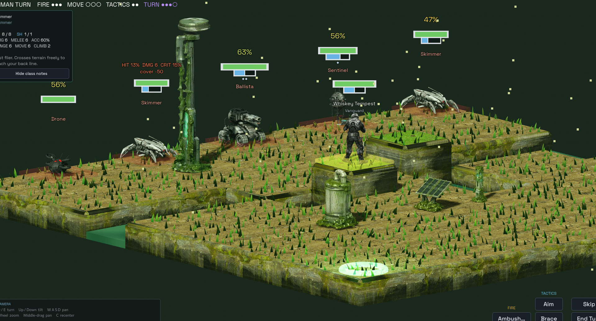
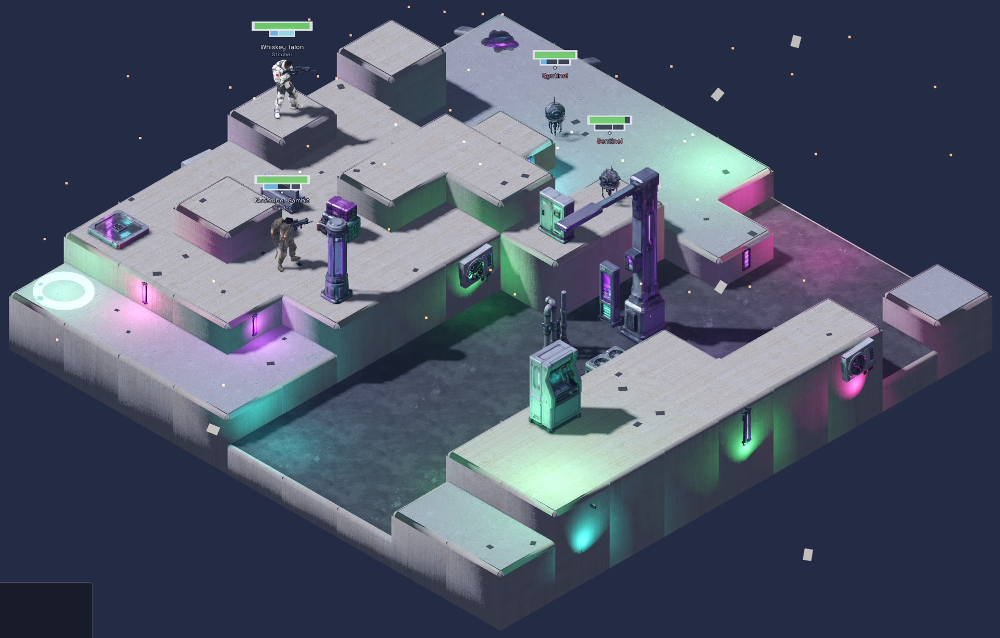

# Chrome Elegy

A turn-based tactics roguelite. Isometric grid combat on procedurally generated maps
across four biomes, where cover, elevation and initiative decide fights before the dice do.

Runs feed the next one: salvage taken from downed machines unlocks classes and abilities
that carry forward, so each attempt starts from a stronger position than the last.

**[Gameplay video, screenshots and design notes →](https://ministral.dev/chrome-elegy.html)**

## Download

Builds are published under [Releases](../../releases). Windows, 64-bit.

The build is **unsigned**, so Windows SmartScreen will warn you the first time you run it.
Click *More info*, then *Run anyway*. Nothing can be done about that short of buying a code
signing certificate, which is hard to justify for a prototype.

## Status

Playable prototype, in QA. Expect rough edges, missing feedback in places, and balance
that has not settled.

## Credits

Design, 3D modelling and music by Pablo Ministral. Implementation written with an AI
coding assistant.
